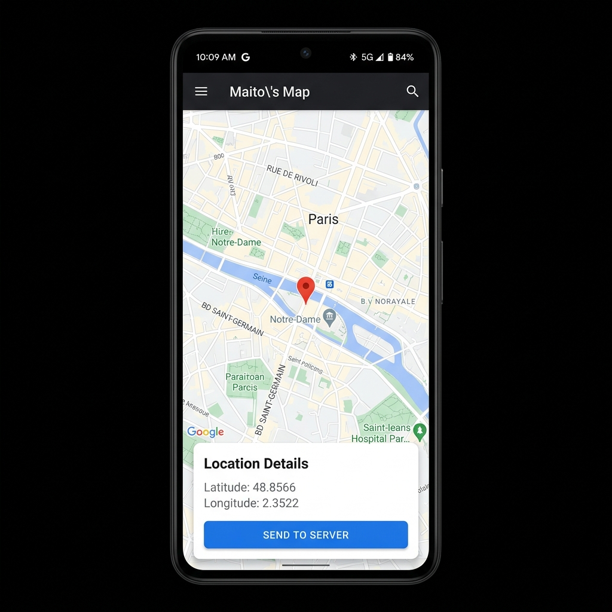

# Maito's Map 🗺️

Maito's Map est un projet Android (basé sur le LAB 11) qui démontre l'intégration de **Google Maps** avec la gestion dynamique des **permissions de localisation** et le suivi GPS en temps réel.

## 📸 Aperçu de l'application



## 🎯 Fonctionnalités clés (Projet unique)

Pour rendre ce projet unique et professionnel :
1. **Un seul Marker réutilisable** : Au lieu de créer un nouveau point sur la carte à chaque changement de position (ce qui pollue visuellement la carte), l'application garde un seul point d'ancrage et modifie ses coordonnées de manière fluide grâce à `animateCamera`.
2. **Architecture propre** : Le code a été renommé et organisé logiquement (`checkPermissionsAndTrack()`, `startLocationTracking()`, `updateMapLocation()`).
3. **Alertes UI personnalisées** : Un design épuré pour la boîte de dialogue lorsque le GPS est désactivé.

## 🚀 Configuration & Lancement

### 1. Remplacer la clé d'API (Très important)
Actuellement, l'application utilise une fausse clé d'API (`AIzaSyDummyKeyForMaitoMap1234567890`) pour éviter d'utiliser des quotas ou des cartes bancaires.
Si vous souhaitez voir la vraie carte Google s'afficher (et non un écran beige avec le logo Google) :
- Rendez-vous sur [Google Cloud Console](https://console.cloud.google.com/).
- Activez le **Maps SDK for Android**.
- Générez une clé API et copiez-la dans le fichier `app/src/main/res/values/strings.xml` :
```xml
<string name="google_maps_key" templateMergeStrategy="preserve" translatable="false">VOTRE_VRAIE_CLE_ICI</string>
```

### 2. Lancer l'application
- Ouvrez ce projet dans **Android Studio**.
- Lancez-le sur un émulateur ou un smartphone physique.
- L'application vous demandera la permission d'accéder à la localisation.
- Acceptez. Si votre GPS est désactivé, l'application vous proposera de l'activer via une alerte.
- La carte se centrera automatiquement de façon fluide sur votre position !

---
*Projet réalisé dans le cadre d'un laboratoire de développement mobile Android.*
